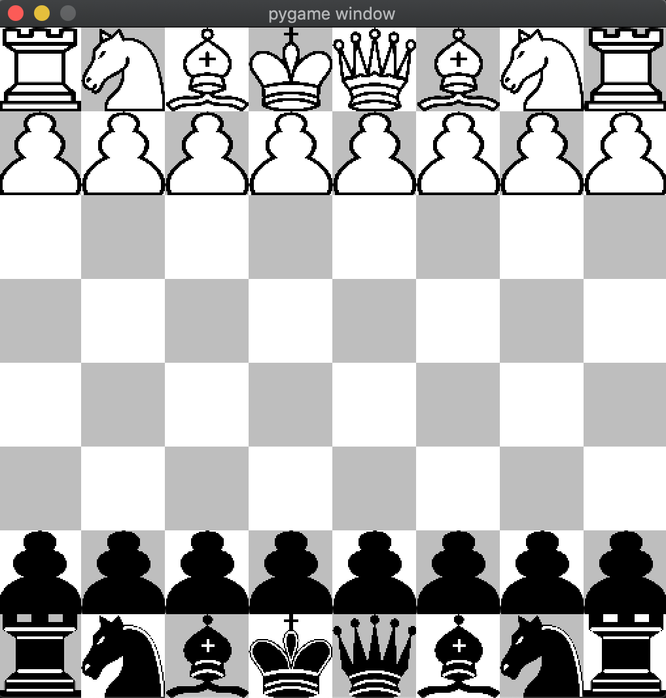

# Python Chess
A GUI chess game including a simple AI, all written in Python. \
<p align="center">

</p>

## Index
1. [About](#about)
2. [Demo](#demo)
3. [Usage](#usage)
    * [Installation](#installation)
    * [Commands](#commands)
4. [Credits](#credits)
5. [License](#license)

<a name="about"></a>
## About
This project includes a full chess engine, gui engine, and an AI engine. The AI engine utilizes the minimax and alpha beta pruning algorithms.

<a name="demo"></a>
## Demo

<a name="usage"></a>
## Usage
To install this project, make sure you have the correct version of Python and Pygame. Certain versions of pygame are no longer supported on macOS Catalina.

<a name="installation"></a>
### Installation
- Switch to Python3.
- Follow the code below to create virtual environment and install the necessary libraries.
(Currently tested on Python 3.7.9 with Pygame 2.0.0dev8 and Python 3.8.2 with Pygame 2.0.0 on macOS Catalina)
```
git clone https://github.com/boosungkim/python-chess.git
cd python-chess
python3 -m venv venv
source venv/bin/activate
pip install pygame
```

<a name="commands"></a>
### Commands
- To start the game, run `python3 -W ignore chess_gui.py`, then select the game mode you want to play in the command line.
- To undo a move, press `u`.
- To reset the board, press `r`.

<a name="credits"></a>
## Credits
Other than the move log idea inspired by Eddie Sharick, the entirety of the chess engine was written by Boo Sung Kim. The GUI engine was largely inspired by Eddie Sharick, but the code was adapted to work with my chess engine. The AI engine was inspired by Sebastian Lague's pseudocode, which was also adapted to work with my other files. 

<a name="license"></a>
## License
This project is licensed under the GNU GPLv3 License - see the [LICENSE](./LICENSE) file for details.